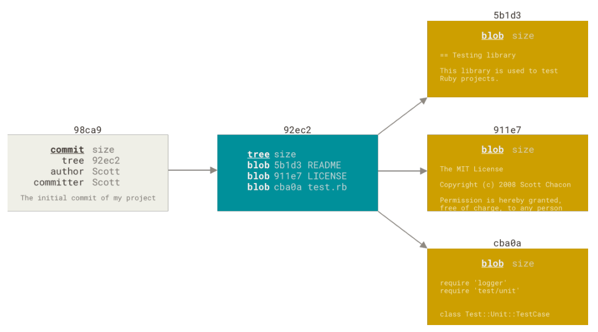
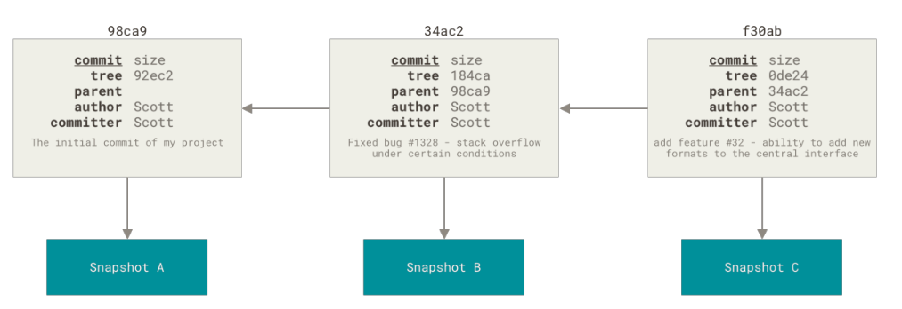

# git-notes

* references
    * https://www.manning.com/books/git-in-practice
    * https://www.manning.com/books/learn-git-in-a-month-of-lunches
    * https://git-scm.com/book/en/v2
    * https://www.biteinteractive.com/understanding-git-merge/
    * https://stackoverflow.com/questions/2304087/what-is-head-in-git
    * https://www.atlassian.com/git/tutorials/git-submodule
    * https://gist.github.com/gitaarik/8735255
    * https://longair.net/blog/2010/06/02/git-submodules-explained/
    * https://www.vogella.com/tutorials/GitSubmodules/article.html

## introduction
* repository
    * is the local collection of all the files related to a particular Git version
            control system and contains a .git subdirectory in its root
    * Git keeps track of the state of the files in the repository’s directory on disk
* `.git` directory
    /.git/config // contains the configuration of the local repository
    /.git/description // is a file that describes the repository
    /.git/HEAD // HEAD pointer, respectively, that point to commits
    /.git/hooks/applypatch-msg.sample // Event hooks
    /.git/info/exclude //  contains files that should be excluded from the repository
    /.git/objects/info // Object information, used for object storage
    /.git/objects/pack // Pack files, used for reference
    /.git/refs/heads // Branch pointers, respectively, that point to commits
    /.git/refs/tags // Tag pointers, respectively, that point to commits
    /.git/index // Git’s index is a staging area used to build up new commits.
* commit
    * contains
        * message entered by the author
        * details of the commit author
        * unique commit reference
            * SHA-1 hashes such as `86bb0d659a39c98808439fadb8dbd594bec0004d`
            * everything in Git is checksummed before it is stored and is then referred to by that checksum
                * all commits effectively provide a checksum of the entire branch up until this point
            * it’s impossible to change the contents of any file or directory without Git knowing about it
            * Git stores everything in its database not by file name but by the hash value of its contents
        * pointer to the preceding commit (parent commit)
            * except for the first commit
        * date the commit was created
        * a pointer to the contents of files when the commit was made (object store context)
* object store
    * git stores all the history, branches, and commits locally
        * example: querying history doesn’t require a network connection
    * Git creates and stores a collection of objects when you commit
    * object store is stored inside the Git repository
    * the main Git objects: commits, blobs, tags, and trees
        * each commit object points to a tree object which represents the state of your source code at that commit
        * tree object contains:
            * references to blob objects for each file in the directory for this version
            * references to tree objects for each subdirectory of the directory for this version
        * blob object contains: contents of the file for this version
* index
    * Git doesn’t add anything to the index without your instruction
    * the first thing you have to do with a file you want to include in a Git repository
    is request that Git add it to the index
    * stores information about what will go into your next commit
* commands
    * git status
        * tell you the state of your working directory
    * git history
        * complete list of all commits made since the repository was created
        * contains references to any branches, merges, and tags made within the repository
    * git add
        * Git stages a file exactly as it is when you run the git add command
        * if you `git commit`, the last `git add` version of the file will go into the commit
            * not the version from your working directory
            * if you modify a file after you run git add, you have to run git add again to
            stage the latest version of the file
        * Git can only keep track of files that it has been told about
            * to introduce a new file you must use `git add` on that file first
    * git commit
        * option: `-a`
            * automatically stage every file that is already tracked before doing the commit
            * performing the git add at the same time as git commit is a common shortcut
            * you have to add the file first (with an initial `git add` ) before this shortcut can work
    * git amend
        * when you’re amending your last commit, you’re replacing it with a new commit
    * git fetch
        * fetches all the changes on the server that you don’t have
        * not modify your working directory
    * git pull
        * two phases
            1. fetching the changes from a remote repository
            1. merging them into the current branch
        * option: `rebase`
    * git push
    * git merge
        * result: a commit that has two (or even more) parent commits
            * the latest commit from the master branch and the latest commit from the feature branch
        * example
            ```
                              otherbranch
                                  |
                        X <- Y <- Z
                       /
            A <- B <- C <- D <- E <- F <- G
                                          |
                                        master
                                          |
                                        HEAD
            ```
            * you are on `master` and you said `git merge otherbranch`
                1. Git first figures out that the merge base is commit C
                1. Git then calculates the diff from C to G (because G is master)
                1. and the diff from C to Z (because Z is otherbranch)
                1. Git then applies both of those diffs to C simultaneously — and commits the result on master
                    * That is the merge commit
            ```
                              otherbranch
                                  |
                        X <- Y <- Z <--------\
                       /                      \
            A <- B <- C <- D <- E <- F <- G <- M
                                               |
                                             master
                                               |
                                             HEAD
            ```
        * conflicts
            * one of the two diffs from the merge base shows that a certain line or clump of lines
            was edited one way, and the other diff shows that the same clump of lines was edited a different way
        * merge strategy
            * is an algorithm that Git uses to decide how to perform a merge
            * `--strategy=recursive`
        * special case: fast-forward merge
            * if incoming branch has the current branch as an ancestor, Git simplifies things
            by moving the pointer forward
                * there is no divergent work to merge
    * git rebase
        * creates new, reparented commits on top of the existing commits
        * all the changes that were committed on one branch and replay them on a different branch
        * after rebasing you can fast-forward master branch
    * git stash
        * you may find yourself working on a new commit and want to temporarily undo your current changes but
        redo them at a later point
        * live in their own namespace refs/stash
        * stashes are stored on a stack structure
            * when running git stash pop, the top stash on the stack ( stash@{0} ) is applied to the working
            directory and removed from the stack
    * git tag
        * usually used to mark release points (v1.0, v2.0 and so on)
        * two types
            * lightweight
                * is like a branch that doesn’t change
                * just a pointer to a specific commit
            * annotated
                * are stored as full objects in the Git database
                * are checksummed
                    * contain the tagger name, email, date, and a tagging message
        * by default, the git push command doesn’t transfer tags to remote servers
            * use `git push origin --tags`
        * `git checkout <tagname>`
        * `git describe --tags` - list all tags
    * git cherry-pick
        * used to include only a single commit from a branch onto the current branch rather than merging
        * remark: sha-1 change on a cherry-pick
    * git diff
    * git revert
    * git config
    * git checkout
    * git reset
        * modifies the current branch pointer so it points to another commit
        * phases
            1. Move the branch HEAD points to (stop here if --soft)
            2. Make the index look like HEAD (stop here unless --hard)
            3. Make the working directory look like the index.
        * vs checkout
            * checkout modifies the HEAD pointer so it points to another branch (or, rarely, commit)
        * example
            * `git commit --amend` resets to the previous commit and then creates a new commit with the same commit
            message as the commit that was just reset
    * git reflog
        * is updated whenever a commit pointer is updated (like a HEAD pointer or branch pointer)
        * if everything is broken, you can use git reflog
            * copy the hash of the event before your mistake, and then run
        * is not shared with other repositories when you git push and aren’t fetched when you git fetch
        * is an ordered list of the commits that HEAD has pointed to
    * git checkout
        * will move HEAD itself to point to another branch (or commit)
        * new command to separate the use cases of git checkout (does too many things)
            * git switch - used to switch branches
            * git restore - restore files to the state they were on a specified commit
    * git filter-branch
        * rewriting the entire history of a branch
        * iterates through the entire history of a branch and lets you rewrite every commit
        * motivation: accidentally committed confidential files
* tracking branch
    * local branches that have a direct relationship to a remote branch
* ref
    * are the possible ways of addressing individual commits
        * branch
            * are pointers to specific commits
            * referencing the branch master is the same as referencing the SHA-1 of the commit at the top of the master branch
            * quicker and easier to remember for referencing commits than SHA-1
            * how does Git know what branch you’re currently on
                * special pointer: HEAD
        * HEAD
            * is you - points to whatever you checked out, wherever you are
                * if you make a commit, HEAD will move, if you checkout something, HEAD will move
            * example: if you checkout master, then master and HEAD are equivalent
            * vs branch
                * typically HEAD does not point to a commit - it points to a branch reference
                * it is attached to that branch, and when you do certain things (e.g., commit or reset), the
                attached branch will move along with HEAD
            * detached HEAD state
                * it means that HEAD points directly to a commit
                * it is called a detached HEAD, because HEAD is pointing to something other than a branch reference
                    * since you don't have a branch attached to you, the branch won't follow along with you as you
                    make new commits
                * you could be on the same commit as your master branch, but if HEAD is pointing to the commit
                rather than the branch, it is detached and a new commit will not be associated with a branch reference
                * representation of (HEAD -> branch) vs. (HEAD, branch) with git log -1
    * `ref~1` or `ref^^` = one commit before that ref
    * git rev-parse
        * see what SHA-1 a given ref expands to

## basics
* three main states that your files can reside in
    * modified
    * staged (index)
    * committed
* anything that is committed in Git can almost always be recovered
    * even commits that were on branches that were deleted
    * or commits that were overwritten with an --amend commit

## submodules
* motivation: while working on one project, you need to use another project from within it
    * external code can be incorporated in a few different ways
        1. external code can be directly copied and pasted into the main repository
        1. incorporating external code is through the use of a language's package management system
        1. git submodules
* allow you to keep a Git repository as a subdirectory of another Git repository
    * is a record that points to a specific commit in another external repository
    * won't automatically be updated if the submodule's repository is updated
    * they can be utilized exactly like stand-alone repositories
* .gitmodules file
    * contains meta data about the mapping between the submodule project's URL and local directory
    * example
        ```
        [submodule "awesomelibrary"]
         path = awesomelibrary
         url = https://bitbucket.org/jaredw/awesomelibrary
        ```
* if you pull in new changes into the submodules, you need to create a new commit in your main
repository in order to track the updates of the nested submodules
    * example
        * one developer updates submodule to the latest commit
            ```
            # have the master branch checked out
            cd [submodule directory]
            git checkout master
            git pull

            # to use the latest commit in master of the submodule
            cd ..
            git commit -m "move submodule to latest commit in master"

            git push
            ```
        * another developer can get the update
            ```
            git pull

            git submodule update
            ```
* commands
    * git submodule update
        * moves into its subdirectory, run git fetch then git checkout the correct version
        * used after pulling a change in the parent repository that updates the revision checked out in the submodule
    * git submodule init
        * if you freshly cloned the repo, you have to initiate submodules
        * pull all the code from the submodule and place it in the directory that it's configured to
    * git submodule status - show the current states of all submodules of a repository

## internals
* A remote repository is generally a bare repository — a Git repository that has no working directory.
  * Because the repository is only used as a collaboration point, there is no reason to have a snapshot
    checked out on disk; it’s just the Git data.
  * In the simplest terms, a bare repository is the contents of
     your project’s .git directory and nothing else.
* Git doesn’t store data as a series of changesets or
  differences, but instead as a series of snapshots.
  * When you make a commit, Git stores a commit object that contains a pointer to the snapshot of the
    content you staged.
  * This object also contains the author’s name and email address, the message that
     you typed, and pointers to the commit or commits that directly came before this commit (its parent
     or parents): zero parents for the initial commit, one parent for a normal commit, and multiple
     parents for a commit that results from a merge of two or more branches.
  * Staging the files computes a checksum for each one (the SHA-1 hash we mentioned
    in What is Git?), stores that version of the file in the Git repository (Git refers to them as blobs), and
    adds that checksum to the staging area:
  * When you create the commit by running git commit, Git checksums each subdirectory (in this case,
    just the root project directory) and stores them as a tree object in the Git repository.
  * Git then creates
    a commit object that has the metadata and a pointer to the root project tree so it can re-create that
    snapshot when needed.
  * Your Git repository now contains five objects: three blobs (each representing the contents of one of
    the three files), one tree that lists the contents of the directory and specifies which file names are
    stored as which blobs, and one commit with the pointer to that root tree and all the commit
    metadata.


* If you make some changes and commit again, the next commit stores a pointer to the commit that
  came immediately before it
  

* git remote --verbose
  origin  https://github.com/mtumilowicz/book-reports.wiki.git (fetch)
  origin  https://github.com/mtumilowicz/book-reports.wiki.git (push)
  * WHAT HAPPENS WHEN THE FETCH AND PUSH URLS DIFFER?
    * The documentation wasn't clear that "remote.<nick>.pushURL" and "remote.<nick>.URL" are there to name the
    * same repository accessed via different transports, not two separate repositories
      * example: ssh, https
* Here’s what a newly-
  initialized .git directory typically looks like:
  * ls -F1
  * config
    description
    HEAD
    hooks/
    info/
    objects/
    refs/
* The description file is used only by the GitWeb
  program, so don’t worry about it.
* The config file contains your project-specific configuration
  options, and the info directory keeps a global exclude file for ignored patterns that you don’t want
  to track in a .gitignore file
* The hooks directory contains your client- or server-side hook scripts,
  which are discussed in detail in Git Hooks.
* The objects directory stores all the content for your
  database, the refs directory stores pointers into commit objects in that data (branches, tags,
  remotes and more), the HEAD file points to the branch you currently have checked out, and the index
  file is where Git stores your staging area information.
* Git Objects
  * Git is a content-addressable filesystem
  * It means that at the core of Git
    is a simple key-value data store
  * What this means is that you can insert any kind of content into a
    Git repository, for which Git will hand you back a unique key you can use later to retrieve that
    content.
  * Now, let’s use git hash-object to create a new data object and manually store it in
    your new Git database
    * echo 'test content' | git hash-object -w --stdin
      d670460b4b4aece5915caf5c68d12f560a9fe3e4
    * git hash-object would take the content you handed to it and merely return the
       unique key that would be used to store it in your Git database. The -w option then tells the command
       to not simply return the key, but to write that object to the database
    * Finally, the --stdin option tells
      git hash-object to get the content to be processed from stdin
    * find .git/objects -type f
      .git/objects/d6/70460b4b4aece5915caf5c68d12f560a9fe3e4
      * This is how Git stores the content initially — as a single file per piece of content, named
         with the SHA-1 checksum of the content and its header
  * git cat-file command
    * command is sort of a Swiss army knife for inspecting Git objects
* Tree Objects
  * is the tree, which solves the problem of storing the
    filename and also allows you to store a group of files together
  * Git stores content in a manner
    similar to a UNIX filesystem, but a bit simplified
  * All the content is stored as tree and blob objects,
    with trees corresponding to UNIX directory entries and blobs corresponding more or less to inodes
    or file contents
  * A single tree object contains one or more entries, each of which is the SHA-1 hash
    of a blob or subtree with its associated mode, type, and filename
  * git cat-file -p master^{tree}
    * master^{tree} syntax specifies the tree object that is pointed to by the last commit on your
    master branch
    
  * Git normally creates a tree by taking the state of your
    staging area or index and writing a series of tree objects from it
* Commit Objects
  * you now have three trees that represent the different snapshots of
    your project that you want to track, but the earlier problem remains: you must remember all three
    SHA-1 values in order to recall the snapshots
  * To create a commit object, you call commit-tree and specify a single tree SHA-1 and which commit
    objects, if any, directly preceded it
  * The format for a commit object is simple: it specifies the top-level tree for the snapshot of the
    project at that point; the parent commits if any (the commit object described above does not have
    any parents); the author/committer information (which uses your user.name and user.email
    configuration settings and a timestamp); a blank line, and then the commit message.
* Object Storage
  * Git concatenates the header and the original content and then calculates the SHA-1 checksum of
    that new content
* Git References
  * find .git/refs
    * .git/refs
      .git/refs/heads
      .git/refs/tags
  * echo 1a410efbd13591db07496601ebc7a059dd55cfe9 > .git/refs/heads/master
    * Now, you can use the head reference you just created instead of the SHA-1 value in your Git
      commands
    * Git provides the safer command
      git update-ref to do this if you want to update a reference
      * git update-ref refs/heads/master 1a410efbd13591db07496601ebc7a059dd55cfe9
    * That’s basically what a branch in Git is: a simple pointer or reference to the head of a line of work
    * To create a branch back at the second commit, you can do this
      * git update-ref refs/heads/test cac0ca
    * When you run commands like git branch <branch>, Git basically runs that update-ref command to
      add the SHA-1 of the last commit of the branch you’re on into whatever new reference you want to
      create.
* HEAD
  * when you run git branch <branch>, how does Git know the SHA-1 of the last
    commit? The answer is the HEAD file
  * Usually the HEAD file is a symbolic reference to the branch you’re currently on
  * By symbolic
    reference, we mean that unlike a normal reference, it contains a pointer to another reference
  * However in some rare cases the HEAD file may contain the SHA-1 value of a git object
    * This happens
      when you checkout a tag, commit, or remote branch, which puts your repository in "detached
      HEAD" state.
  * cat .git/HEAD // ref: refs/heads/master
    * If you run git checkout test
    * cat .git/HEAD // ref: refs/heads/test
  * git symbolic-ref HEAD // read the value of your HEAD
    * git symbolic-ref HEAD refs/heads/test // set the value of HEAD
* Tags
  * The tag object is very much like a commit object — it contains a tagger, a date, a message,
    and a pointer
  * The main difference is that a tag object generally points to a commit rather than a
    tree
  * It’s like a branch reference, but it never moves — it always points to the same commit but
    gives it a friendlier name
  * If you create an annotated tag, Git creates a tag object and then writes a reference to
    point to it rather than directly to the commit
  * Also notice that it
    doesn’t need to point to a commit; you can tag any Git object
* Remotes
  * If you add a remote and push to it,
    Git stores the value you last pushed to that remote for each branch in the refs/remotes directory
* Packfiles
  * Wouldn’t it be nice if Git could store one of them in full but then the second object only as the delta
    between it and the first?
* Removing Objects
  * However, if someone at any point in the history of your project added a single huge file, every clone
    for all time will be forced to download that large file, even if it was removed from the project in the
    very next commit. Because it’s reachable from the history, it will always be there.