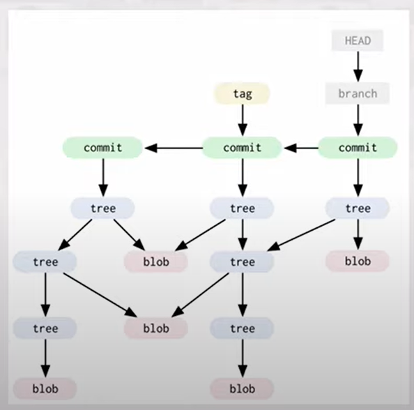
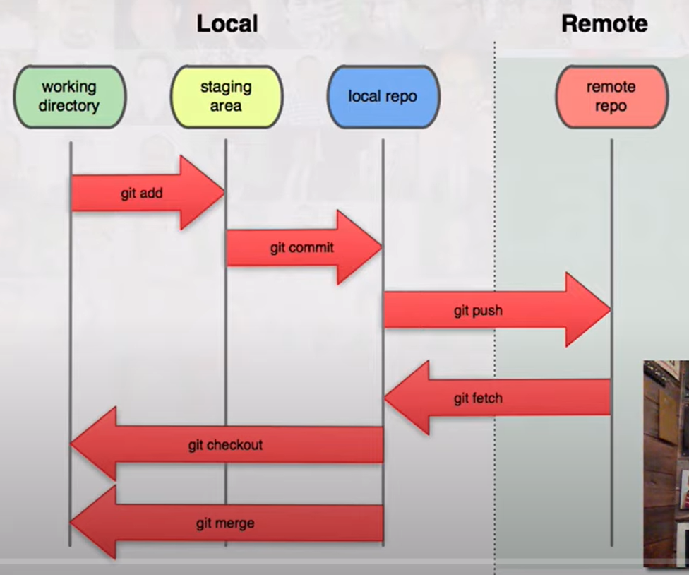
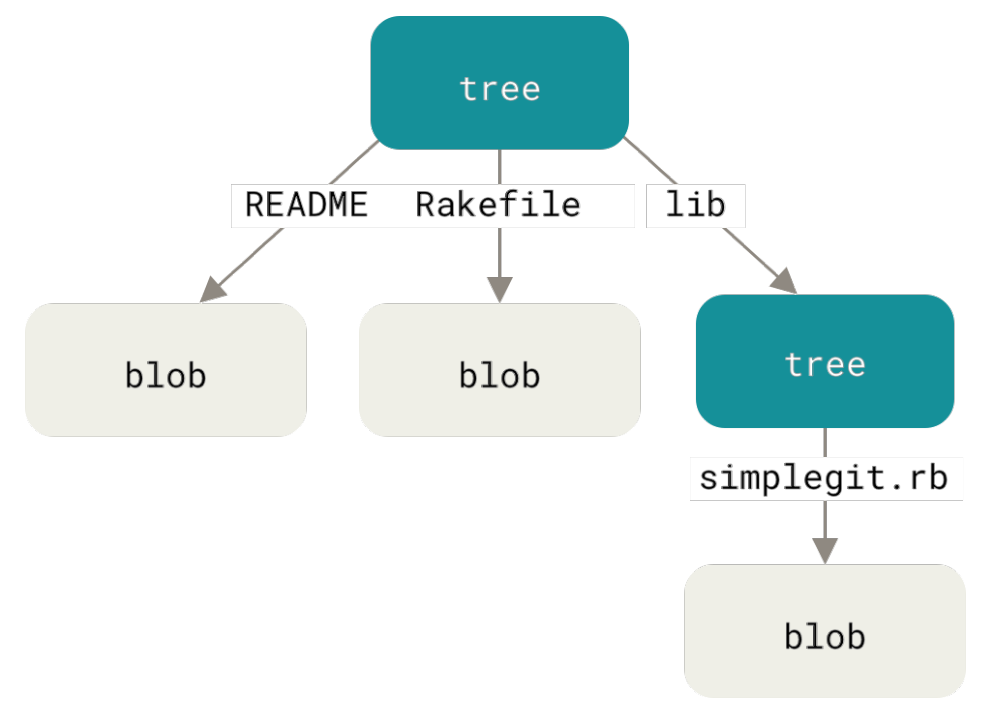

# git-notes

* references
    * https://www.manning.com/books/git-in-practice
    * https://www.manning.com/books/learn-git-in-a-month-of-lunches
    * https://git-scm.com/book/en/v2
    * https://www.biteinteractive.com/understanding-git-merge/
    * https://stackoverflow.com/questions/2304087/what-is-head-in-git
    * https://www.atlassian.com/git/tutorials/git-submodule
    * https://gist.github.com/gitaarik/8735255
    * https://longair.net/blog/2010/06/02/git-submodules-explained/
    * https://www.vogella.com/tutorials/GitSubmodules/article.html
    * https://matthew-brett.github.io/curious-git/git_object_types.html
    * https://stackoverflow.com/questions/61379397/how-is-git-using-git-objects-to-store-the-file-format
    * [https://www.youtube.com/watch?v=P6jD966jzlk](Git Internals - How Git Works - Fear Not The SHA!)
    * https://github.com/pluralsight/git-internals-pdf

## basics
* repository
    * is the local collection of the files and contains a `.git` subdirectory in its root
    * Git keeps track of the state of the files in the repository’s directory on disk
    * remote repository = bare repository (Git repository that has no working directory)
        * is only used as a collaboration point
        * just the Git data (`.git` directory and nothing else)
        * git remote --verbose
            ```
            origin  https://github.com/mtumilowicz/book-reports.wiki.git (fetch)
            origin  https://github.com/mtumilowicz/book-reports.wiki.git (push)
            ```
            * what happens when the fetch and push urls differ?
                * same repository accessed via different transports, not two separate repositories
                    * example: ssh, https
    * git stores all the history, branches, and commits locally
        * example: querying history doesn’t require a network connection
* git objects
    * commits, blobs, tags, and trees
    * overview
    
* commit
    * contains
        * message entered by the author
        * details of the commit author
        * unique commit reference
            * SHA-1 hashes such as `86bb0d659a39c98808439fadb8dbd594bec0004d`
            * everything in Git is checksummed before it is stored and is then referred to by that checksum
                * all commits effectively provide a checksum of the entire branch up until this point
            * it’s impossible to change the contents of any file or directory without Git knowing about it
            * Git stores everything in its database not by file name but by the hash value of its contents
        * pointer to the preceding commit (parent commit)
            * except for the first commit
        * date the commit was created
        * each commit object points to a tree object which represents the state of your source code at that commit
* index
    * Git doesn’t add anything to the index without your instruction
    * the first thing you have to do with a file you want to include in a Git repository
    is request that Git add it to the index
    * stores information about what will go into your next commit
    * workflow
        
* ref
    * are the possible ways of addressing individual commits
        * branch
            * are pointers to specific commits
            * referencing the branch master is the same as referencing the SHA-1 of the commit at the top of the master branch
            * quicker and easier to remember for referencing commits than SHA-1
            * how does Git know what branch you’re currently on
                * special pointer: HEAD
            * tracking branch
                * local branches that have a direct relationship to a remote branch
        * HEAD
            * is you - points to whatever you checked out, wherever you are
                * if you make a commit, HEAD will move, if you checkout something, HEAD will move
            * example: if you checkout master, then master and HEAD are equivalent
            * vs branch
                * typically HEAD does not point to a commit - it points to a branch reference
                * it is attached to that branch, and when you do certain things (e.g., commit or reset), the
                attached branch will move along with HEAD
            * detached HEAD state
                * it means that HEAD points directly to a commit
                * it is called a detached HEAD, because HEAD is pointing to something other than a branch reference
                    * since you don't have a branch attached to you, the branch won't follow along with you as you
                    make new commits
                * you could be on the same commit as your master branch, but if HEAD is pointing to the commit
                rather than the branch, it is detached and a new commit will not be associated with a branch reference
                * representation of (HEAD -> branch) vs. (HEAD, branch) with git log -1
            * example
                ```
                cat .git/HEAD // ref: refs/heads/master
                If you run git checkout test
                cat .git/HEAD // ref: refs/heads/test
                ```
        * tag
            * contains a tagger, a date, a message, and a pointer
            * points to a commit rather than a tree
            * like a branch reference, but it never moves
                * always points to the same commit but gives it a friendlier name
            * doesn’t need to point to a commit; you can tag any Git object
    * `ref~1` or `ref^^` = one commit before that ref
    * git rev-parse
        * see what SHA-1 a given ref expands to

## commands
* git status
    * tell you the state of your working directory
* git history
    * complete list of all commits made since the repository was created
    * contains references to any branches, merges, and tags made within the repository
* git add
    * Git stages a file exactly as it is when you run the git add command
    * if you `git commit`, the last `git add` version of the file will go into the commit
        * not the version from your working directory
        * if you modify a file after you run git add, you have to run git add again to
        stage the latest version of the file
    * Git can only keep track of files that it has been told about
        * to introduce a new file you must use `git add` on that file first
* git commit
    * option: `-a`
        * automatically stage every file that is already tracked before doing the commit
        * performing the git add at the same time as git commit is a common shortcut
        * you have to add the file first (with an initial `git add` ) before this shortcut can work
* git amend
    * when you’re amending your last commit, you’re replacing it with a new commit
* git fetch
    * fetches all the changes on the server that you don’t have
    * not modify your working directory
* git pull
    * two phases
        1. fetching the changes from a remote repository
        1. merging them into the current branch
    * option: `rebase`
* git push
* git merge
    * result: a commit that has two (or even more) parent commits
        * the latest commit from the master branch and the latest commit from the feature branch
    * example
        ```
                          otherbranch
                              |
                    X <- Y <- Z
                   /
        A <- B <- C <- D <- E <- F <- G
                                      |
                                    master
                                      |
                                    HEAD
        ```
        * you are on `master` and you said `git merge otherbranch`
            1. Git first figures out that the merge base is commit C
            1. Git then calculates the diff from C to G (because G is master)
            1. and the diff from C to Z (because Z is otherbranch)
            1. Git then applies both of those diffs to C simultaneously — and commits the result on master
                * That is the merge commit
        ```
                          otherbranch
                              |
                    X <- Y <- Z <--------\
                   /                      \
        A <- B <- C <- D <- E <- F <- G <- M
                                           |
                                         master
                                           |
                                         HEAD
        ```
    * conflicts
        * one of the two diffs from the merge base shows that a certain line or clump of lines
        was edited one way, and the other diff shows that the same clump of lines was edited a different way
    * merge strategy
        * is an algorithm that Git uses to decide how to perform a merge
        * `--strategy=recursive`
    * special case: fast-forward merge
        * if incoming branch has the current branch as an ancestor, Git simplifies things
        by moving the pointer forward
            * there is no divergent work to merge
* git rebase
    * creates new, reparented commits on top of the existing commits
    * all the changes that were committed on one branch and replay them on a different branch
    * after rebasing you can fast-forward master branch
* git stash
    * you may find yourself working on a new commit and want to temporarily undo your current changes but
    redo them at a later point
    * live in their own namespace refs/stash
    * stashes are stored on a stack structure
        * when running git stash pop, the top stash on the stack ( stash@{0} ) is applied to the working
        directory and removed from the stack
* git tag
    * usually used to mark release points (v1.0, v2.0 and so on)
    * two types
        * lightweight
            * is like a branch that doesn’t change
            * just a pointer to a specific commit
        * annotated
            * are stored as full objects in the Git database
            * are checksummed
                * contain the tagger name, email, date, and a tagging message
    * by default, the git push command doesn’t transfer tags to remote servers
        * use `git push origin --tags`
    * `git checkout <tagname>`
    * `git describe --tags` - list all tags
* git cherry-pick
    * used to include only a single commit from a branch onto the current branch rather than merging
    * remark: sha-1 change on a cherry-pick
* git diff
* git revert
* git config
* git checkout
* git reset
    * modifies the current branch pointer so it points to another commit
    * phases
        1. Move the branch HEAD points to (stop here if --soft)
        2. Make the index look like HEAD (stop here unless --hard)
        3. Make the working directory look like the index.
    * vs checkout
        * checkout modifies the HEAD pointer so it points to another branch (or, rarely, commit)
    * example
        * `git commit --amend` resets to the previous commit and then creates a new commit with the same commit
        message as the commit that was just reset
* git reflog
    * anything that is committed in Git can almost always be recovered
        * even commits that were on branches that were deleted
        * or commits that were overwritten with an --amend commit
    * is updated whenever a commit pointer is updated (like a HEAD pointer or branch pointer)
    * if everything is broken, you can use git reflog
        * copy the hash of the event before your mistake, and then run
    * is not shared with other repositories when you git push and aren’t fetched when you git fetch
    * is an ordered list of the commits that HEAD has pointed to
* git checkout
    * will move HEAD itself to point to another branch (or commit)
    * new command to separate the use cases of git checkout (does too many things)
        * git switch - used to switch branches
        * git restore - restore files to the state they were on a specified commit
* git filter-branch
    * rewriting the entire history of a branch
    * iterates through the entire history of a branch and lets you rewrite every commit
    * motivation
        * accidentally committed confidential files
        * committed a single huge file, every clone for all time will be forced to download that
        large file, even if it was removed from the project
            * it’s reachable from the history, it will always be there

## submodules
* motivation: while working on one project, you need to use another project from within it
    * external code can be incorporated in a few different ways
        1. external code can be directly copied and pasted into the main repository
        1. incorporating external code is through the use of a language's package management system
        1. git submodules
* allow you to keep a Git repository as a subdirectory of another Git repository
    * is a record that points to a specific commit in another external repository
    * won't automatically be updated if the submodule's repository is updated
    * they can be utilized exactly like stand-alone repositories
* .gitmodules file
    * contains meta data about the mapping between the submodule project's URL and local directory
    * example
        ```
        [submodule "awesomelibrary"]
         path = awesomelibrary
         url = https://bitbucket.org/jaredw/awesomelibrary
        ```
* if you pull in new changes into the submodules, you need to create a new commit in your main
repository in order to track the updates of the nested submodules
    * example
        * one developer updates submodule to the latest commit
            ```
            # have the master branch checked out
            cd [submodule directory]
            git checkout master
            git pull

            # to use the latest commit in master of the submodule
            cd ..
            git commit -m "move submodule to latest commit in master"

            git push
            ```
        * another developer can get the update
            ```
            git pull

            git submodule update
            ```
* commands
    * git submodule update
        * moves into its subdirectory, run git fetch then git checkout the correct version
        * used after pulling a change in the parent repository that updates the revision checked out in the submodule
    * git submodule init
        * if you freshly cloned the repo, you have to initiate submodules
        * pull all the code from the submodule and place it in the directory that it's configured to
    * git submodule status - show the current states of all submodules of a repository

## internals
* `.git` directory
    * /.git/config // contains the configuration of the local repository
    * /.git/description // is a file that describes the repository
    * /.git/HEAD // HEAD pointer, respectively, that point to commits
    * /.git/hooks/applypatch-msg.sample // event hooks: client- or server-side hook scripts
    * /.git/info/exclude //  contains files that should be excluded from the repository
    * /.git/objects/info // object information, used for object storage
    * /.git/objects/pack // pack files, used for reference
    * /.git/refs/heads // branch pointers, respectively, that point to commits
    * /.git/refs/tags // tag pointers, respectively, that point to commits
    * /.git/refs/remotes // stores the value you last pushed to that remote for each branch
    * /.git/index // git’s index is a staging area used to build up new commits
* Git doesn’t store data as a series of changesets or differences but as a series of snapshots
* at the core of Git is a simple key-value data store
    * you can insert any kind of content into a Git repository, for which Git will hand you
    back a unique key you can use later to retrieve that content
        * example
            1. echo 'test content' | git hash-object -w --stdin
                * option: -w
                    * not simply return the key, but to write that object to the database
                * option: --stdin
                    * tells git hash-object to get the content to be processed from stdin
            1. find .git/objects -type f
* Git stores content in a manner similar to a UNIX filesystem, but a bit simplified
    * all the content is stored as tree and blob objects
        * trees ~ UNIX directory entries
        * blobs ~ inodes or file contents
    * each commit hash points to the tree object which in turn points to hash of blobs(files) and other tree's(folders)
* example
    
* commands
    * git cat-file -t <hash>
        * shows us the type of the object represented by a particular hash
    * git cat-file -p <hash>
        * shows the contents of the file associated with this hash
    * hash could be obtained from `git log`